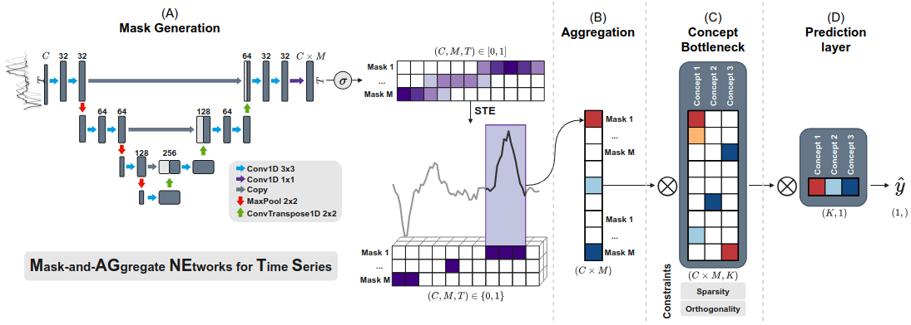

<div align='center'>

# When, How Long and How Much? Interpretable Neural Networks for Time Series Regression by Learning to Mask and Aggregate

[Florent Forest](https://florentfo.rest)<sup>1</sup>&nbsp;&nbsp;&nbsp;
[Amaury Wei](https://people.epfl.ch/amaury.wei)<sup>1</sup>&nbsp;&nbsp;&nbsp;
[Olga Fink](https://people.epfl.ch/olga.fink)<sup>1</sup>
<br/>
<sub>
<sup>1</sup> Intelligent Maintenance and Operations Systems (IMOS), EPFL, Lausanne, Switzerland
</sub>

[](https://arxiv.org/abs/2512.03578)

</div>

Source code for the implementation of the pre-print [When, How Long and How Much? Interpretable Neural Networks for Time Series Regression by Learning to Mask and Aggregate](https://arxiv.org/abs/2512.03578).

In this paper, we propose **MAGNETS** (**M**ask-and-**AG**gregate **NE**twork for **T**ime **S**eries), an inherently interpretable neural architecture for time series extrinsic regression (TSER). MAGNETS learns a compact set of human-understandable concepts without requiring any annotations. Each concept corresponds to a learned, mask-based aggregation over selected input features, explicitly revealing both which features drive predictions and when they matter in the sequence. Predictions are formed as combinations of these learned concepts through a transparent, additive structure, enabling clear insight into the model's decision process. 

<div align='center'>
<br/>
<span style="color: #777">MAGNETS architecture for interpretable time series regression.</span>
</div>

## Requirements

- fire
- numpy
- pandas
- pytorch-lightning
- scikit-learn
- scipy
- sktime
- torch
- torchmetrics
- tqdm
- wandb

For the streamlit dashboard app:
- matplotlib
- plotly
- streamlit

## Basic usage

```shell
python magnets/train.py --help
```

## Project structure

```
dashboard/
└── app.py: streamlit app for interactive visualizations
datasets/: dataset files
magnets/
├── data/: dataset loading classes
├── models/: model implementations
├── utils/
    ├── loss.py: loss functions
    └── maskgen.py: mask generator networks
├── run_baselines.py: main script for training and evaluating non-deep learning baselines
└── train.py: main script for training MAGNETS and other neural network baselines (CNN, NATM, GATSM) 
```

## Datasets

The following datasets are included in this repo:

- Synthetic datasets (univariate, bivariate, trivariate-1, trivariate-2)
- Static Bridge simulation dataset

For the TSER archive datasets, they can be downloaded using the aeon toolkit, see:

- https://github.com/aeon-toolkit/aeon
- https://www.aeon-toolkit.org/en/latest/examples/benchmarking/regression.html


## Citation

If this work was useful to you, please cite our pre-print:

```BibTeX
@misc{forest2025magnets,
  title={When, How Long and How Much? Interpretable Neural Networks for Time Series Regression by Learning to Mask and Aggregate}, 
  author={Florent Forest and Amaury Wei and Olga Fink},
  year={2025},
  eprint={2512.03578},
  archivePrefix={arXiv},
  primaryClass={cs.LG},
  url={https://arxiv.org/abs/2512.03578}, 
}
```

## Acknowledgements

We would like to thank the researchers from UCR, UEA and Monash University for their amazing efforts in curating the TSER archive of real-world time series datasets.
